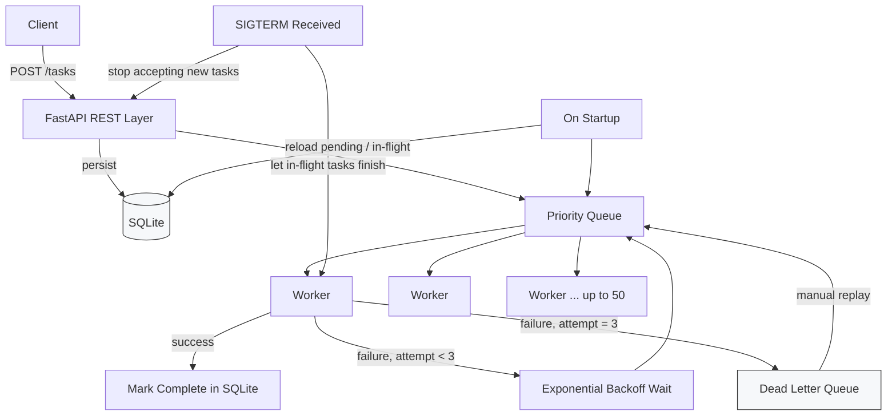

[](https://github.com/Sumit-Todwal/Task_Queue/actions/workflows/ci.yml)

# Distributed Task Queue System

An async task queue built from scratch in Python — no Celery, no Redis, no RabbitMQ. State is persisted in SQLite so the queue survives a restart, and a pool of async workers pulls tasks by priority with retry, backoff, and dead-letter handling built in.

[**Live Demo**](https://taskqueue-production.up.railway.app)

---

## Why build this instead of using Celery/RQ

The goal was to understand what a task queue actually has to solve underneath a library like Celery: how tasks get picked up without dropping or double-processing them, what happens when a task fails intermittently vs. permanently, and how the system recovers if the process crashes mid-task. Building it directly, rather than configuring an existing broker, meant implementing that logic instead of trusting it.

## Architecture



## How it works

**Task submission**
A task is submitted through the FastAPI REST layer, assigned a priority, and written to SQLite before being placed on the in-memory priority queue — persisting first means a crash between submission and pickup doesn't lose the task.

**Worker pool**
Up to 50 async workers pull from the priority queue concurrently. Higher-priority tasks are dequeued ahead of lower-priority ones regardless of submission order.

**Retry with exponential backoff**
If a task raises an exception, it's requeued for retry with an exponentially increasing delay, up to 3 attempts, so a transient failure (e.g. a downstream API blip) gets a real chance to succeed on retry instead of failing immediately.

**Dead Letter Queue (DLQ)**
After 3 failed attempts, a task is moved to the DLQ instead of being retried indefinitely. DLQ entries are inspectable and can be replayed back onto the main queue individually once the underlying issue is fixed.

**Crash recovery**
On startup, the system reads pending and in-flight task state back from SQLite and re-populates the queue — a process restart doesn't silently drop tasks that were mid-flight.

**Graceful shutdown**
On receiving a shutdown signal, the API stops accepting new tasks and workers are allowed to finish whatever they're currently executing before the process exits, rather than being killed mid-task.

## Tech Stack

| Layer | Choice |
|---|---|
| API | FastAPI |
| Concurrency | Python `asyncio` / threading |
| Persistence | SQLite |
| Deployment | Docker, Railway |
| CI | GitHub Actions |

## CI/CD

Every push runs the test suite via GitHub Actions; merges to `main` deploy to Railway.

## Running Locally

```bash
git clone https://github.com/Sumit-Todwal/Task_Queue.git
cd Task_Queue
pip install -r requirements.txt
# see repo for the app entrypoint / uvicorn command
```

Or with Docker:

```bash
docker build -t task-queue .
docker run -p 8000:8000 task-queue
```

## Known Limitations

- Single-process worker pool — horizontal scaling across multiple machines isn't implemented (would require moving off in-process SQLite to a shared store).
- Priority is a static field set at submission time, not dynamically re-evaluated while a task waits.
